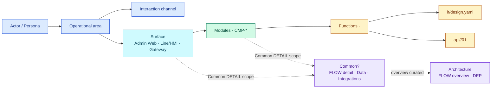
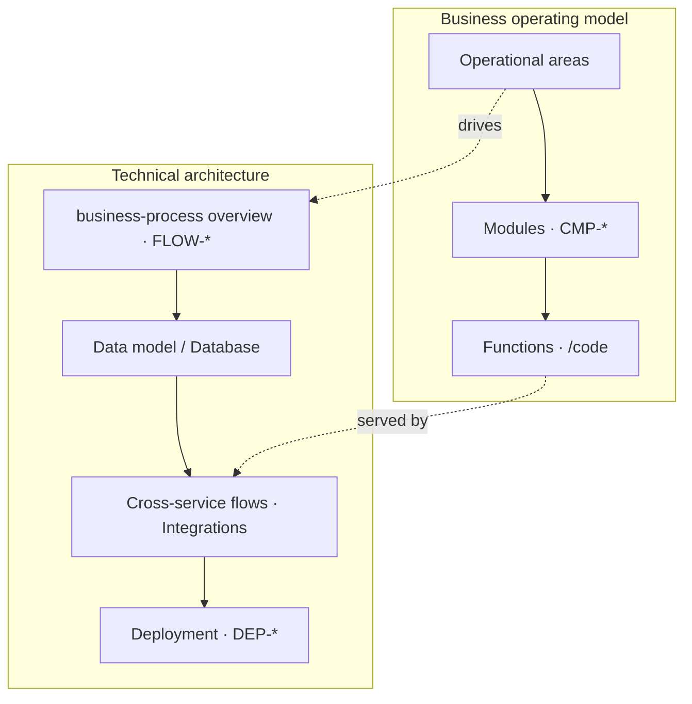

# System doc structure — canonical layer meanings, Operating Model và Architecture

Cấu trúc tài liệu biểu diễn một hệ thống theo hai góc nhìn bổ trợ:

- **Business Operating Model:** actor nào vận hành hệ thống, thuộc operational area nào và sử dụng capability nào.
- **Technical Architecture:** business-process nào chạy, dữ liệu nào được chia sẻ, luồng nào giao tiếp với nhau và cách deploy chúng.

`Web`, `Client` và `API` là technical channel, không phải business operational area.

Cây chuẩn (khớp [Start now](./getting-started.md)):
`Overview` → `Operational areas` → `Surfaces` → **`Common?` (động)** → `Modules` → `Functions` → `Architecture`.

`Common?` là node **động theo scope** (system / surface / module): hiện khi có artifact dùng chung, ẩn khi rỗng — không phải layer bắt buộc luôn có folder. Tài liệu này giải nghĩa ngữ nghĩa từng layer, nơi đặt SSOT và **write rule** để toolkit/codegen không lệch.

**People entry:** [Start now](./getting-started.md)  
**IDs / codegen stay:** `CMP-*` · `W-*` · `API-*` · `FLOW-*` · `DEP-*` · `SC-*` · `TC-*` · `UI-CMN-*` / `API-CMN-*` (system common)

---

## 0. Canonical layer meanings

| Layer | Canonical meaning | Typical contents | Do not confuse with |
|-------|-------------------|------------------|---------------------|
| `Overview` | Mục đích, phạm vi, actor/persona, operational areas. | Purpose, scope, goals, assumptions. | Architecture chapter. |
| `Architecture` | Tổng quan kỹ thuật: business-process chính, data, integrations, deployment. | Curated `FLOW-*` overview, data/integration overview, `DEP-*`. | Surface navigation. |
| `Surfaces` | Bề mặt tương tác theo kênh nghiệp vụ. | Surface tree, entry points, surface-level common. | Operational area · repo/service. |
| `Module` | Năng lực nghiệp vụ (`CMP-*`) có SSOT + owner surface. | Module README, boundaries, dependencies. | Framework folder. |
| `Common` | Artifact dùng chung theo scope `system / surface / module`. | Detail `FLOW-*`, data model, integrations. | Sao chép Module. |
| `Function` | Hành vi chi tiết của một function slug. | `W-*`, `API-*`, validation, acceptance. | API runtime service. |

---

## 0.1 Write rules (SSOT lock)

Đây là contract bắt buộc cho toàn bộ các công cụ của **Forgekit** (Bộ Docs, Bộ Code, Bộ Test, Common).

### business-process · `FLOW-*`

| Home | Vai trò | Độ sâu |
|------|---------|--------|
| `architecture/03-business-process/FLOW-*.md` | Tổng quan các flow **chính** của hệ thống | Sơ sài, curated |
| Common theo scope (`product/surfaces/common/…`, `product/surfaces/<surface>/common/…`, `…/CMP-*/common/…`) | Chi tiết business-process của scope đó | Đầy đủ actor/action/outcome/exception |

- Cùng một `FLOW-*` có thể được điều hướng từ Common? và Architecture.
- **Không** nhân bản nội dung mâu thuẫn: Architecture = overview; Common = detail.
- Skill Bộ Docs: `/business-process`. Brownfield evidence: `/business-process-trace` (không sở hữu product `FLOW-*`).

### Function · physical layout

Nav label = `Functions`. **Không** tạo thư mục tên `functions/`.

```text
product/surfaces/<owner-surface>/CMP-*/
├─ index.md                          # module README (MD only)
├─ common?/                          # yaml/ + processes/FLOW-* (optional)
└─ <NN>/<NN>/…/                      # cluster số, ví dụ 01/01/01
   ├─ <slug>.bundle.yaml
   ├─ ir/design.yaml                 # FE + Testkit
   ├─ ir/spec.yaml                   # business
   ├─ ir/generated/<slug>.md
   └─ api/<seq>/                     # 01-backend-spec · 02-openapi · 03-mock
```

- Folder màn = numeric leaf dưới `CMP-*` (không `modules/`, không `code/W-*`).
- Skill: `/spec` · `/grill-bqa` · `/grill-dev` · `/api-spec`.

### Common path (chỉ các nhà sau)

| Scope | Path |
|-------|------|
| System | `product/surfaces/common/` |
| Surface | `product/surfaces/<surface>/common/` |
| Module | `product/surfaces/<owner-surface>/CMP-*/common/` |

- **Cấm** `product/shared/`, `product/common/`, `docs/common/`, `docs/features/`.
- Data model / integrations dùng Common theo scope (`/db-erd`, `/cross-service`).

### Common IDs (registry)

| Prefix | Ý nghĩa | Path chuẩn |
|--------|---------|------------|
| `UI-CMN-*` | Common UI (shell, empty, shared molecule) | `product/surfaces/common/code/UI-CMN-*` |
| `API-CMN-*` | Common API (health, shared contract) | `product/surfaces/common/code/API-CMN-*` |

- Registry `docs-index.json` → `codeIds` phải resolve bằng path có **`/code/`** (không `…/common/UI-*` trực tiếp).
- Common theo surface/module scope không bắt buộc ID `*-CMN-*`; dùng path scoped `…/common/` + ID riêng nếu cần.

### Module multi-surface

- Mỗi `CMP-*` có **một owner surface** → folder vật lý chỉ nằm dưới surface đó.
- Surface khác chỉ **map/link** tới Module SSOT, không copy.
- Module README ghi rõ `ownerSurface` và danh sách surface liên kết.

### Target / resolve ID (thay CTR)

- Đã **xóa** `CTR-*` / Context / Containers khỏi public contract.
- Các công cụ gen code/test (**Bộ Code / Bộ Test**) ưu tiên resolve theo ID: `W-*`, `API-*`, `CMP-*`, `FLOW-*`, `DEP-*`, `SC-*`, `TC-*`.
- Khi cần target composite (SC/TC): `surface` + `CMP-*` + `W-*`.
- `DEP-*` **chỉ** cho deployment (`architecture/07-deployment/`), không thay target màn hình.

### Overview

- Home: `product/overview/` (+ `operational-areas/`).
- Skill: `/overview`.
- **Không** dùng `LND-*` / landscape ID trong contract này.

---

## 1. Business operating model

```text
Overview
└─ Operational areas
   ├─ Admin operations
   ├─ Workforce operations
   ├─ Shop-floor operations
   └─ Plant integration

Surfaces
├─ Common?                         # scope toàn hệ thống — chỉ hiện khi có
│  ├─ business-process · FLOW-*    # DETAIL theo scope
│  ├─ Data model / Database
│  └─ Cross-service flows · Integrations
│
├─ Admin Web
│  ├─ Common?                      # scope surface — DETAIL
│  │  ├─ business-process · FLOW-*
│  │  ├─ Data model / Database
│  │  └─ Cross-service flows
│  └─ Modules · CMP-*              # owner surface giữ SSOT
│     ├─ Common?                   # scope module — DETAIL
│     │  ├─ business-process · FLOW-*
│     │  ├─ Data model / Database
│     │  └─ Cross-service flows
│     └─ Functions                 # nav label
│        └─ <function-slug>/       # folder vật lý
│           └─ code/{W-*,API-*}/   # template children
│
├─ Line Client / HMI               # cùng cấu trúc; link Module nếu không phải owner
└─ Integration / Gateway           # …

Architecture
├─ business-process · FLOW-*       # OVERVIEW flow chính, sơ sài
├─ Data model / Database           # overview khi cần
├─ Cross-service flows · Integrations
└─ Deployment · DEP-*
```

`Common?` là node **động**: hiện khi scope có artifact dùng chung, ẩn khi rỗng.



Quan hệ many-to-many:

- One persona may use several channels.
- One channel may serve several operational areas.
- One surface repeats `Common? → Modules → Functions`.
- One module has one owner surface; other surfaces link to it.
- A Function may expose a screen, an API contract, or both.
- Every surface answers: `who`, `what action`, `who owns`.

### Vocabulary

| Term | Meaning | Do not confuse with |
|------|---------|---------------------|
| **Operational area** | Nhóm hoạt động nghiệp vụ | Runtime implementation |
| **Persona / actor** | Người hoặc hệ thống thực hiện hoạt động | Channel |
| **Interaction channel** | Điểm tương tác: Web Portal, Line Client, HMI, Gateway | Operational area |
| **Surface** | Bề mặt tương tác gom Module/Function | Operational area · Deployment |
| **Common** | Node động chứa detail dùng chung theo scope | Module riêng lẻ |
| **Module** | Năng lực (`CMP-*`) có owner surface + SSOT | Framework folder |
| **Function** | Folder `<function-slug>` dưới Module; nav label “Functions” | Thư mục tên `functions/` |
| **business-process** | `FLOW-*`: Architecture = overview; Common = detail | Cross-service topology thuần kỹ thuật |

---

## 2. Quan hệ giữa Operating Model và Architecture



Thuật ngữ “API”:

- **Backend API service** = runtime service.
- **API endpoint/contract** = Function detail (`API-*` dưới `<slug>/code/`).

---

## 3. Content standards by layer

| Layer | Pure text | Diagrams / DB / sequence |
|-------|-----------|---------------------------|
| **Overview** | purpose, scope, actor, constraints | Short narrative |
| **Architecture** | business-process overview, data/integration overview, deployment | Flowchart, sequenceDiagram (sparse) |
| **Surfaces** | interaction language, owner, action | Surface tree |
| **Module** | ownership, boundaries, dependencies | Module mapping |
| **Common** | shared detail by scope | Detail flowchart / ERD / sequence |
| **Function** | screen/API behaviour, validation, acceptance | Screen/API detail |

Prefer `flowchart` / `sequenceDiagram`.

---

## 4. Map → technical SSOT

| Node | Technical home | Skill |
|------|----------------|-------|
| Overview | `product/overview/` | `/overview` |
| Operational areas | `product/overview/operational-areas/` | `/overview` |
| business-process overview | `architecture/03-business-process/FLOW-*.md` | `/business-process` |
| business-process detail | Common theo scope | `/business-process` |
| Module | `product/surfaces/<owner-surface>/CMP-*/` | `/module` |
| Function / screen | `…/CMP-*/<NN…>/` (`*.bundle.yaml` + `ir/`) | `/spec` · grill |
| API contract | `…/CMP-*/<NN…>/api/<seq>/` | `/api-spec` |
| Common / DB | `product/surfaces/common/` · scoped `…/common/` | `/db-erd` |
| Cross-service | Common theo scope | `/cross-service` |
| Deployment | `architecture/07-deployment/` | `/deployment` |

Nav uses business labels; `forgekit init` generates physical children under `<function-slug>/`.

---

## 5. Architecture folder policy

| Chapter | Status | Path |
|---------|--------|------|
| `03` business-process | **Active** — curated main `FLOW-*` overview | `architecture/03-business-process/` |
| `07` Deployment | **Active** — stub-first `DEP-*` | `architecture/07-deployment/` |
| Other chapters (`01`…`02`, `04`…`06`, `08`…`12`) | Stub OK khi có concern thật | `architecture/<nn>-…/` |

README / index chỉ highlight Active `03` + `07`; không liệt kê `01…12` như bắt buộc.

---

## 6. Skills compliance

1. `/overview` owns `product/overview/` and operational areas.
2. `/architecture` is the only architecture router.
3. `/business-process` owns product `FLOW-*` (overview + detail by target path).
4. `/module` owns each module once under its owner surface.
5. `/spec` owns Function `<slug>/code/{W-*,API-*}`.
6. `/business-process-trace` = brownfield evidence only.

Router: `/architecture` → overview / surfaces / business-process / module / function / data / integration / deployment.

---

## 7. Pilot shape — Auth

```text
overview                 → product/overview/
operational area         → Admin operations
owner surface            → admin-web
business-process overview→ architecture/03-business-process/FLOW-login
module Auth              → product/surfaces/admin-web/CMP-01/
  leaf                   → …/01/01/01/  (bundle + ir/ + api/01/)
deployment               → DEP-* (chỉ khi placement matters)
```

---

## 8. Related

- [Start now](./getting-started.md) — onboarding and responsibility matrix
- Skills được cài đặt tự động vào `.agents/` thông qua hệ thống `forgekit init` dựa trên Project Type — xem [Kits (MCP)](./toolkits.md).
