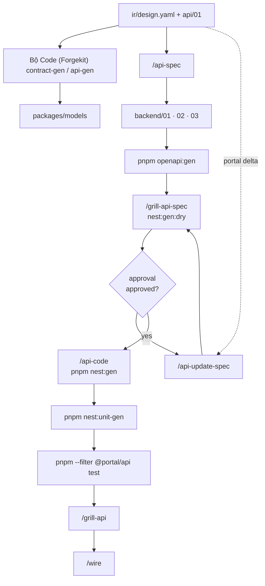
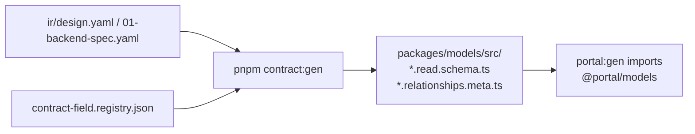
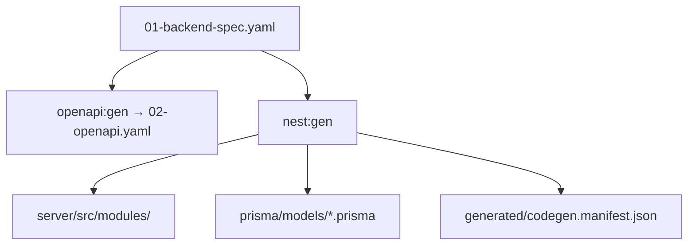
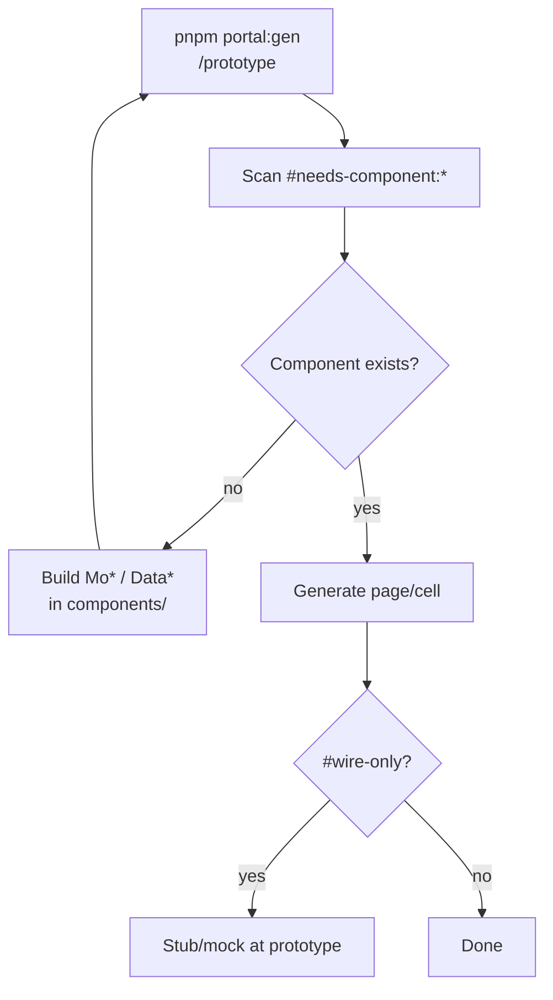
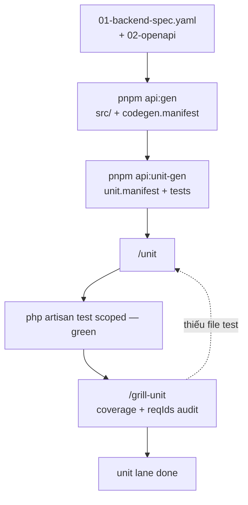
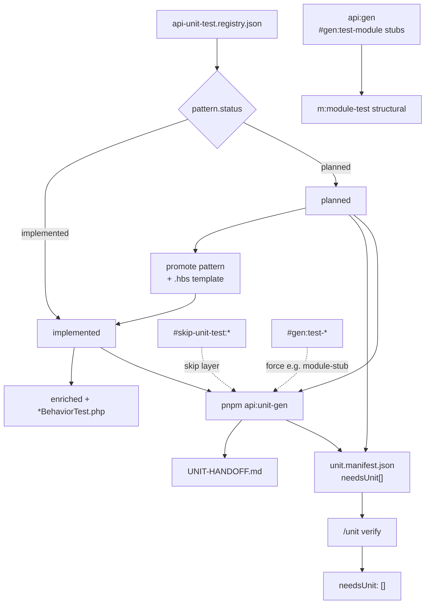
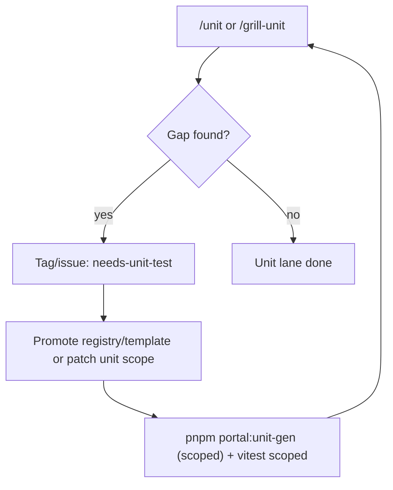

# Backend / API phase (Nest in-repo)

> Hub: [BACKEND-CODEGEN](https://github.com/raintr91/lara12/blob/v3/docs/operational/BACKEND-CODEGEN.md) · [TEAM-AI-BACKEND-WORKFLOW](./backend-workflow.md) · [FULL-CYCLE-PIPELINE-DIAGRAM](./overview.md)

Phase **2c API** — chạy **song song** portal scaffold (2a) và E2E prep (2b); converge tại **Wire** (phase 3).

---

## API cycle (tổng)



---

## Sub-lane: Contract (`contract:gen`)



Chi tiết field `kind`, scopes, relation: [CONTRACT-FIELD-REGISTRY](../4-contracts/field-registry.md).

---

## Sub-lane: Codegen (`openapi:gen`)



Cấu trúc module CQRS: [NEST-API-STRUCTURE](https://github.com/raintr91/next_nest/blob/next_nest_v3/docs/operational/NEST-API-STRUCTURE.md) · Laravel API git: [quickstart](https://github.com/raintr91/lara12/blob/v3/docs/operational/BACKEND-API-QUICKSTART.md).

> **Lưu ý:** `openapi:gen` là lệnh chung của Bộ Code (Forgekit) cho mọi BE adapter (Nest, FastAPI, …). FastAPI export OpenAPI tách biệt khỏi Nest.

---

## Sub-lane: API unit (Jest)

**Không gộp diagram này** — xem file riêng: [NEST-UNIT-PHASE-DIAGRAM](https://github.com/raintr91/next_nest/blob/next_nest_v3/docs/operational/NEST-UNIT-PHASE-DIAGRAM.md).

Tóm tắt: `nest:gen` → `nest:unit-gen` → `pnpm --filter @portal/api test` → `/grill-api` → `/wire`.

---

## Command chain

| Mục tiêu | Chuỗi |
|----------|--------|
| Contract Zod | dev-grill fill `entities.fields` → `pnpm contract:gen` |
| Feature backend mới | `/api-spec` → `openapi:gen` → `/grill-api-spec` → `/api-code` |
| Portal đổi spec | `/api-update-spec` → `/grill-api-spec` → … |
| API unit verify | `nest:unit-gen` → Jest green → `/grill-api` |

---

## Lệnh mẫu

```bash
pnpm contract:gen:dry --spec `base-docs` / `--id`
pnpm contract:gen --spec `base-docs` / `--id`
pnpm openapi:gen --spec `base-docs` / `--id`
pnpm nest:gen:dry --spec `base-docs` / `--id`
pnpm nest:gen --spec .../backend/01-backend-spec.yaml --force
pnpm nest:unit-gen --spec .../backend/01-backend-spec.yaml --force
pnpm --filter @portal/api test
pnpm dev:api
```

Pilot: ``base-docs` Product Code (prefer `--id`)`

---

## Liên kết

| Doc | Nội dung |
|-----|----------|
| [BACKEND-CODEGEN](https://github.com/raintr91/lara12/blob/v3/docs/operational/BACKEND-CODEGEN.md) | Hub script backend |
| [NEST-UNIT-PHASE-DIAGRAM](https://github.com/raintr91/next_nest/blob/next_nest_v3/docs/operational/NEST-UNIT-PHASE-DIAGRAM.md) | Jest lane chi tiết |
| [CONTRACT-FIELD-REGISTRY](../4-contracts/field-registry.md) | Field registry |
| [NEST-API-STRUCTURE](https://github.com/raintr91/next_nest/blob/next_nest_v3/docs/operational/NEST-API-STRUCTURE.md) | Common layer |
| [WIRE-PHASE-DIAGRAM](./overview.md) | Sau `/api-code` |
| [Portal reference](https://github.com/raintr91/nuxt_4/blob/nuxt_v_3/docs/operational/PORTAL-CODEGEN.md) | `portal:gen` (FE, không models) |
| [UNIT-PHASE-DIAGRAM](./overview.md) | Vitest portal (song song) |
| [TEST-PHASE-DIAGRAM](./overview.md) | E2E (song song) |

Legacy Laravel `<api-checkout>` — read-only reference khi port pattern.
# Wire phase

> **Phase 3 Wire** — [FULL-CYCLE-PIPELINE-DIAGRAM](./overview.md). Detail TBD.

<pre class="pipeline-diagram">
api-code done  →  /wire  →  /grill-api
</pre>

Grill gap → `/update-spec` (xem overview).

## Liên kết (phase này)

| Doc | Nội dung |
|-----|----------|
| [UPDATE-SPEC-FLOW](./quality-maintenance.md) | Clear `#update:*` · `wireCount++` |
| [TECH-DEBT-FLOW](./quality-maintenance.md) | `deferTo: wire` |
| [Portal reference](https://github.com/raintr91/nuxt_4/blob/nuxt_v_3/docs/operational/PORTAL-CODEGEN.md) | `portal:unit-gen --phase wire` |
| [UNIT-PHASE-DIAGRAM](./overview.md) | Vitest sau wire delta |
| [TEST-PHASE-DIAGRAM](./overview.md) | E2E sau integration |
| [BACKEND-PHASE-DIAGRAM](./overview.md) | API track trước wire |
# Needs component flow



## Tag format

```
#needs-component:{cell-key}:MoXxx:label
```

Example: `#needs-component:cell-status:MoStatusBadge:Status`

## Related tags

| Tag | Meaning |
|-----|---------|
| `#needs-component:*` | Missing molecule/organism — build before re-gen |
| `#custom-slot:*` | Non-standard cell renderer |
| `#wire-only:*` | Defer real implementation to `/wire` |

## Flow

1. Dev grill adds `#needs-component` tags during `/grill-dev`.
2. `/prototype` or `pnpm portal:gen` scans tags and reports missing components.
3. Developer builds `Mo*` / `Data*` in `components/molecules/` or `components/organisms/`.
4. Re-run `pnpm portal:gen` until no unresolved `#needs-component` tags remain.

See [Portal codegen reference](https://github.com/raintr91/nuxt_4/blob/nuxt_v_3/docs/operational/PORTAL-CODEGEN.md) · `.cursor/extracts/codegen/tags.md`

## Liên kết (cùng phase)

| Doc | Nội dung |
|-----|----------|
| [Portal reference](https://github.com/raintr91/nuxt_4/blob/nuxt_v_3/docs/operational/PORTAL-CODEGEN.md) | `portal:gen` scan tags · HANDOFF |
| [DESIGN-REGISTRY-PROMOTION](../3-artifacts/design-registry-promotion.md) | `#shell:` · `#widget:` promote |
| [DESIGN-PHASE-DIAGRAM](./overview.md) | `/prototype` trong design cycle |
# Unit phase — PHPUnit (API dev lane)

> **Standalone** — không nằm [TEAM-AI-BACKEND-WORKFLOW](./backend-workflow.md) diagram chính (spec → codegen → Portal wire).  
> Hub: `unitgen/runners/README.md` · Skills: `/unit` · `/grill-unit`

---

## Unit lane (flow chính)

Chỉ luồng PHPUnit dev — **không** gộp tag lifecycle, **không** loop grill ↔ unit săn 100%.



| Bước | Ai | Việc |
|------|-----|------|
| `api:gen` | script | Module + `#gen:test-module` stubs; auto `api:unit-gen` (`#gen:test-unit`) |
| `api:unit-gen` | script | Enriched + `*BehaviorTest.php` → `unit.manifest.json` |
| **`/unit`** | dev + AI | `needsUnit` clear, PHPUnit **green** scoped (`UnitTestCase`) |
| **`/grill-unit`** | dev + AI | Coverage module + `reqIds` — **audit**, không regen hàng loạt |

**`api:gen --force`** mới pass `--force` sang `api:unit-gen`. Stub dedupe: phase `all` skip `m:module-test` khi codegen/workspace đã có structural `*Test.php` — xem README `api-unit-gen`.

**`/grill-unit` không loop** đến khi 100%: pass → done; gap → bảng đề xuất; quay `/unit` chỉ khi thiếu **file** test.

---

## `#needs-unit-test` — tag lifecycle

Theo `unitgen/runners/` + `registries/unit-test.registry.json`.



| Tag / field | Nghĩa |
|-------------|--------|
| `needsUnit[]` | Registry debt — `pattern.status: planned` (export-report, login-as, …) |
| `#needs-unit-test:*` | HANDOFF mirror; clear khi pattern `implemented` + tests green |
| `#gen:test-module` | Structural stub (`api:gen` / `m:module-test`) |
| `#gen:test-unit` | Auto `api:unit-gen` sau `api:gen` (crud-standard) |
| `#gen:test-module-stub` | Force `m:module-test` (bypass stub dedupe) |
| `#manual-action:*` | Map → pattern qua `manualTopicMap` + `when` |
| App concerns | `src/tests/Unit/Concerns/` — `commonBaselines`, không gen per module |

Phases `api:unit-gen`: `stub` · `enriched` · `behavioral` · `all` (default).

---

## Layer map (entity)

| Prod | Structural (make / `m:module-test`) | Enriched / behavioral (`api:unit-gen`) |
|------|-------------------------------------|----------------------------------------|
| `Http/Requests/*SearchRequest` | `{Request}Test.php` stub | enriched hooks + `*RulesKeysBehaviorTest.php` |
| `Http/Queries/{Entity}Query` | `{Entity}QueryTest.php` | `{Entity}QueryChainScopeBehaviorTest.php` |
| `Http/Actions/{Entity}Action` | `{Entity}ActionTest.php` | `{Entity}ActionRelationshipsBehaviorTest.php` |
| `Http/Resources/{Entity}Resource` | `{Entity}ResourceTest.php` | `*OpenApiShape*` · `*NestedRelations*` |
| Controller | `{Entity}ControllerInvokeTest.php` | invoke-all pattern |

---

## Lệnh mẫu

```bash
Bộ Code (Forgekit) api-gen -- --spec product/surfaces/…/api/01/01-backend-spec.yaml
Bộ Code (Forgekit) api-unit-gen -- --spec product/surfaces/…/api/01/01-backend-spec.yaml --force

cd src && php artisan test --testsuite=ModuleChain --filter=Hotel
cd src && php artisan test --coverage --testsuite=ModuleChain
```

---

## Liên kết

| Doc | Mục đích |
|-----|----------|
| [TEAM-AI-BACKEND-WORKFLOW](./backend-workflow.md) | Spec → codegen → wire (không unit) |
| `unitgen/runners/README.md` | Dedupe stub, `--force`, phases |
| `.cursor/extracts/api-unit-test-tags.md` | Hashtag reference |
| `.cursor/skills/unit/SKILL.md` | `/unit` |
| `.cursor/skills/grill-unit/SKILL.md` | `/grill-unit` |
# Needs unit flow



## Khi nào dùng

- `needsUnit[]` còn debt trong manifest/HANDOFF.
- Thiếu file unit ở layer logic (schema/service/composable/store action).
- Coverage/reqIds audit fail ở `/grill-unit`.

## Hành động chuẩn

1. Ghi gap rõ trong `/grill-unit` (không chạy full regen mặc định).
2. Nếu là pattern chung: promote registry + template.
3. Re-gen scoped bằng `pnpm portal:unit-gen` và chạy vitest scoped.
4. Grill lại; pass thì chốt unit lane.

## Liên kết

| Doc | Nội dung |
|-----|----------|
| [UNIT-PHASE-DIAGRAM](./overview.md) | Unit lane chi tiết |
| [UNIT-REGISTRY-PROMOTION](../3-artifacts/unit-registry-promotion.md) | Promote pattern/tag |
| [Portal unit-gen roadmap](https://github.com/raintr91/nuxt_4/blob/nuxt_v_3/docs/operational/PORTAL-UNIT-GEN-ROADMAP.md) | Roadmap + pattern status |
