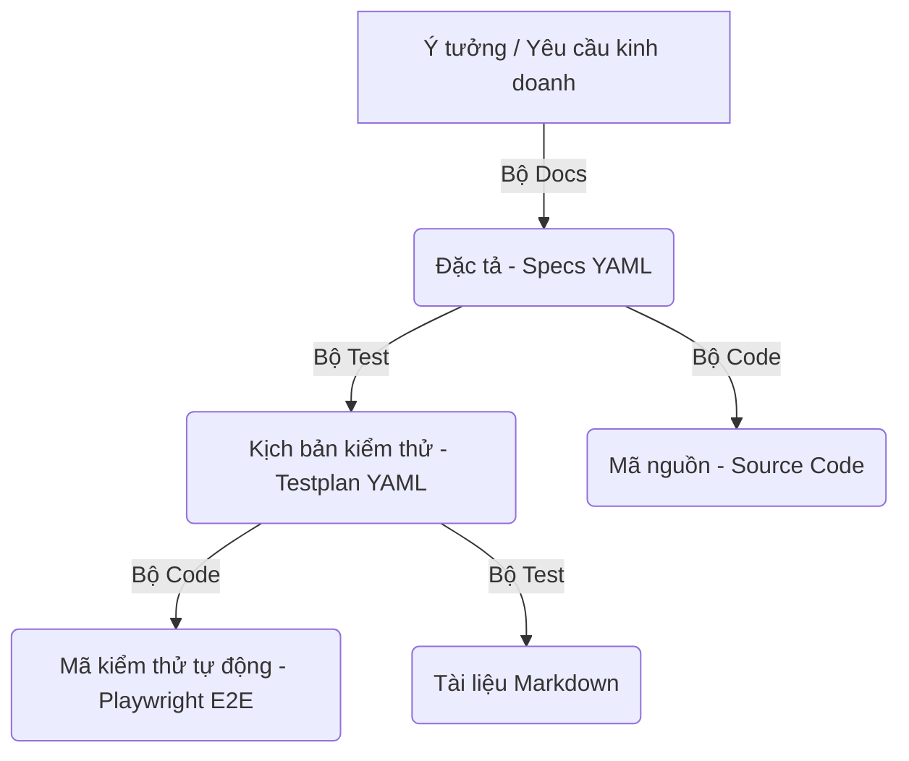
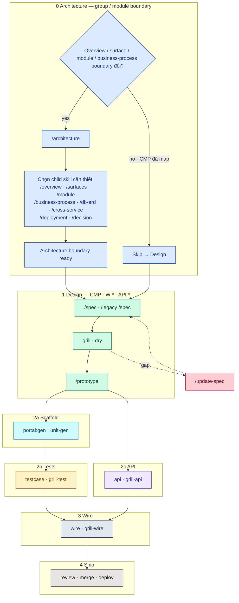
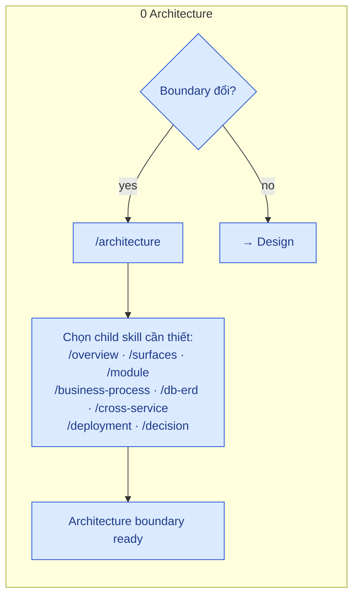
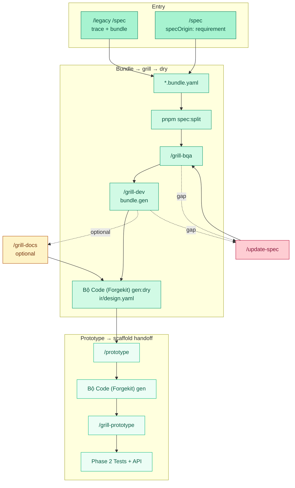

# 🏛 Sổ Tay Kiến Trúc & Vòng Đời Của Forgekit

Tài liệu này giải thích cách hệ thống **Forgekit** vận hành dưới nắp capo, từ lúc bắt đầu hình thành ý tưởng (Bullet points) cho đến khi sinh ra mã nguồn và tài liệu test hoàn chỉnh.

Sau khi gộp nhất 5 công cụ rời rạc, Forgekit được chia làm 3 bộ máy cốt lõi (Suites):
1. **Bộ Docs**: Phụ trách xử lý Tài liệu, Đặc tả (Specs) cho cả Frontend, Backend, và Common.
2. **Bộ Code**: Phụ trách sinh mã nguồn thực thi (Code FE/BE), sinh Unit Test, và sinh mã kiểm thử tự động (Playwright E2E).
3. **Bộ Test**: Phụ trách quản lý, kiểm tra, và kết xuất các kịch bản kiểm thử (Test Case Documents) từ YAML sang Markdown.

---

## 1. Bức Tranh Toàn Cảnh (The Big Picture)

Forgekit hoạt động như một dây chuyền sản xuất tự động, nơi dữ liệu chảy qua 3 bộ máy liên hoàn:

- Nhờ có chung một **Artifact Registry DSL** (Ngôn ngữ định nghĩa cấu trúc), các bộ máy này hiểu nhau tuyệt đối. Khi Bộ Docs cập nhật một trường dữ liệu, Bộ Code và Bộ Test lập tức nhận biết được.

---

## 2. Vòng Đời Của Một Đặc Tả (Spec Lifecycle)

Mỗi Spec (Đặc tả) trong hệ thống đều trải qua một vòng đời sinh tử rất khắt khe. Dưới đây là cách luồng dữ liệu (Data Pipeline) di chuyển:

### Giai đoạn 1: Khởi tạo & Phân tích (Discovery)
Khi lập trình viên đưa vào các gạch đầu dòng (Bullets) tự nhiên:
- Agent sử dụng công cụ `artifactgraph_analyze` để soi chiếu với kho Registry hiện tại.
- **Tự động gắn Tag (Gaps Detection)**: 
  - Nếu yêu cầu vẽ một bảng UI nhưng thiếu Component tương ứng → Hệ thống nảy sinh thẻ `#needs-component`.
  - Nếu BE cần trả ra dữ liệu nhưng chưa có API → Hệ thống nảy sinh thẻ `#needs-endpoint`.
  - Nếu phát hiện logic mới hoàn toàn → Đề xuất `#registry-miss`.

### Giai đoạn 2: Phản biện & Bóc tách (Grill Phase)
Quá trình thảo luận giữa Agent và Lập trình viên có thể tạo ra những điểm mù hoặc quyết định cần trì hoãn:
- **QA & Tech Debt**: Thay vì ghi nháp vào Spec, hệ thống ép buộc phải đẻ ra một file vật lý tại thư mục `qa/open/QA-<id>-<NNNN>.yaml`.
- File này chứa phân loại rõ ràng: `kind: customer` (Chờ BA/Khách hàng xác nhận) hoặc `kind: tech-debt` (Nợ kỹ thuật cần xử lý sau).

### Giai đoạn 3: Biên dịch & Liên kết (Render Phase)
Khi bạn chạy lệnh của **Bộ Docs** (ví dụ `forgekit build`):
- Engine `open-qa.mjs` sẽ quét toàn bộ thư mục `qa/open/`.
- Nó tự động bế các câu hỏi mở và nợ kỹ thuật nối thẳng vào file Markdown cuối cùng (Dưới dạng tag `#missing_info QA-...` hoặc `pendingTechDebt[]`).

### Giai đoạn 4: Đóng luồng (Resolution)
- Khi vấn đề được giải quyết, file YAML đó sẽ được Agent hoặc Lập trình viên di dời từ `qa/open/` sang `qa/resolved/`.
- Ở lần build tiếp theo, tất cả tag rác và cảnh báo nợ kỹ thuật sẽ tự động bốc hơi khỏi tài liệu.

---

## 3. Hệ Sinh Thái Skills Của AI Agent

Để thúc đẩy vòng đời trên chạy trơn tru, Forgekit cung cấp một dàn Agent Skills mạnh mẽ:

### 3.1. Nhóm thao tác với Docs (Bộ Docs)
- **`grill-dev` / `grill-api-spec` / `grill-bqa`**: Các skill "khó tính". Nhiệm vụ của chúng là soi mói các lỗ hổng trong Spec, đào bới logic mâu thuẫn để tạo ra các câu hỏi mở (`qa/open/`).
- **`qa-resolve`**: Chuyên gia dọn dẹp. Nhiệm vụ là đọc câu trả lời của Lập trình viên, cập nhật lại Spec và di chuyển file QA sang mục đã giải quyết (`resolved`).

### 3.2. Nhóm thao tác với Code (Bộ Code)
- Sử dụng các skill và công cụ sinh mã nguồn để chuyển hóa Specs thành Code thực thi.
- Sinh ra Component Frontend, API Backend, và các file Unit Test bám sát tuyệt đối theo hành vi đã được thống nhất ở Bộ Docs.

### 3.3. Nhóm thao tác với Test (Bộ Test)
- Phân tích Coverage để đảm bảo không có Spec nào bị bỏ sót kịch bản kiểm thử (Testplan).

---

## 4. Mối Quan Hệ Của Các Scripts Dưới Nắp Capo

CLI chính yếu `bin/forgekit.mjs` đóng vai trò là "Nhạc trưởng" điều phối toàn bộ các yêu cầu người dùng xuống các Engine bên dưới:

- **Bộ Docs (`engines/docs/`, `engines/openapi/`)**: Phụ trách lệnh `build`, `split`, `openapi_render`. Nơi biến YAML thành tài liệu tĩnh Vitepress.
- **Bộ Code (`engines/codegen/`)**: Nhận lệnh `gen`, `unit-gen`, `api-gen`. Nơi tích hợp các Adapter (NextJS, FastAPI, DotNet) để sinh code thực tế và mã Unit Test/Playwright E2E.
- **Bộ Test (`engines/cases/`)**: Nhận lệnh `cases:render`, `cases:check`. Nơi chịu trách nhiệm nhào nặn các kịch bản kiểm thử định dạng YAML thành chuẩn Markdown để con người dễ đọc.

---

# Full cycle pipeline — Tổng quan

> Overview **một concern** · Detail từng phase → file riêng ([Toolchain index](..)).
> Mermaid: subgraph = phase (gam màu) · node trong phase = tint nhạt cùng hue. Zoom: `vitepress-mermaid-renderer`.

---

## Palette (cố định)

| Phase | Hue | Subgraph / accent | Node tint |
|-------|-----|-------------------|-----------|
| **0** Architecture | Blue | `#93C5FD` / stroke `#1D4ED8` | `#DBEAFE` |
| **1** Design | Emerald | `#6EE7B7` / `#047857` | `#D1FAE5` |
| **2a** Scaffold | Cyan | `#67E8F9` / `#0E7490` | `#CFFAFE` |
| **2b** Tests | Amber | `#FCD34D` / `#B45309` | `#FEF3C7` |
| **2c** API | Violet | `#C4B5FD` / `#6D28D9` | `#EDE9FE` |
| **3** Wire | Slate | `#94A3B8` / `#334155` | `#E2E8F0` |
| **4** Ship | Stone | `#A8A29E` / `#44403C` | `#E7E5E4` |
| Gap (`/update-spec`) | Rose | — | `#FECDD3` |

---

## Toàn flow (Phase 0 + 1…4)

Detail Design (node trong gam emerald): [DESIGN-PHASE-DIAGRAM](#).

---

## Phase map

| Phase | Đại diện | Detail |
|-------|----------|--------|
| **0** Architecture | Overview/surface/module/business-process boundary · `FLOW-*` · deployment | `/architecture` router + `/overview` `/surfaces` `/module` `/business-process` `/deployment` · [Toolkits](../1-guide/toolkits.md) |
| 1 Design | bundle → ir/design + ir/spec → prototype | [DESIGN-PHASE-DIAGRAM](#) · [Toolchain index](./) |
| 2a Scaffold | `portal:gen` · `portal:unit-gen` · HANDOFF / manifests | [Portal reference](https://github.com/raintr91/nuxt_4/blob/nuxt_v_3/docs/operational/PORTAL-CODEGEN.md) |
| 2b Tests | `*.test.yaml` · `testcase:gen` · grill-test | [TEST-PHASE-DIAGRAM](./overview.md) |
| 2c API | api-spec · grill-api · api-code | [BACKEND-PHASE-DIAGRAM](./overview.md) |
| 3 Wire | wire · grill-wire | [WIRE-PHASE-DIAGRAM](./overview.md) |
| 4 Ship | review · merge · deploy | — |

**Skip Phase 0** khi chỉ sửa screen/API trong Module đã có surface, business-process và deployment mapping ổn định.

## Feature artifact (tách file)

| Diagram | File |
|---------|------|
| Layout yaml/md | [FEATURE-ARTIFACT-LAYOUT](../3-artifacts/layout.md) |
| Bundle ↔ IR | [FEATURE-ARTIFACT-BUNDLE-IR](../3-artifacts/bundle-and-ir.md) |
| Legacy dynamics | [FEATURE-ARTIFACT-LEGACY-DYNAMICS](./overview.md) |
| Grill | [FEATURE-ARTIFACT-GRILL](../3-artifacts/grill-process.md) |
| Lệnh script | [CLI-AND-COMMANDS](../6-reference/cli-and-commands.md) |

## Gap loop

[UPDATE-SPEC-FLOW](./quality-maintenance.md) · [TECH-DEBT-FLOW](./quality-maintenance.md) · [NEEDS-COMPONENT-FLOW](./overview.md) · [NEEDS-TEST-FLOW](./overview.md) · [NEEDS-UNIT-FLOW](./overview.md)

## Related docs

| Doc | Nội dung |
|-----|----------|
| [TEST-PHASE-DIAGRAM](./overview.md) | E2E lane · testcase:gen · grill-test |
| [UNIT-PHASE-DIAGRAM](./overview.md) | Vitest lane · portal:unit-gen |
| [Portal reference](https://github.com/raintr91/nuxt_4/blob/nuxt_v_3/docs/operational/PORTAL-CODEGEN.md) | portal:gen + portal:unit-gen |
| [Portal unit-gen roadmap](https://github.com/raintr91/nuxt_4/blob/nuxt_v_3/docs/operational/PORTAL-UNIT-GEN-ROADMAP.md) | Roadmap smoke / registry / PRs |
| [DESIGN-PHASE-DIAGRAM](#) | Spec → grill → prototype (+ Architecture gate) |
| [BACKEND-PHASE-DIAGRAM](./overview.md) | API repo |
| [WIRE-PHASE-DIAGRAM](./overview.md) | Integration |

## Design phase — Pipeline cycle

> Chi tiết **Phase 1** · Hub: [Toolchain index](..)

Diagram tách nhỏ: [FEATURE-ARTIFACT-GRILL](../3-artifacts/grill-process.md) · [FEATURE-ARTIFACT-BUNDLE-IR](../3-artifacts/bundle-and-ir.md)

Gam màu Design = **emerald** (khớp full-cycle). Architecture gate = **blue** (Phase 0).

---

## Architecture gate (Phase 0 — trước Design khi cần)

Chỉ chạy khi **overview / surface / module / business-process boundary** thay đổi hoặc cần integration/deployment mới. Skip nếu các mapping này đã ổn định.

Skills: `/architecture` router · `/overview` · `/surfaces` · `/module` · `/business-process` · `/deployment`. Product `FLOW-*`: `architecture/03-business-process/`.

---

## Design cycle (Phase 1)

Tint trong gam emerald: **Entry** đậm hơn · **Core** giữa · **Out** nhạt hơn · optional grill-with = amber (không phải bước default) · gap = rose.

---

## Ma trận lệnh

| Lệnh | Artifact |
|------|----------|
| `/architecture` … (Phase 0) | Overview, surfaces, modules, `architecture/03-business-process/FLOW-*`, deployment/ADR — không bundle Code |
| `/legacy /spec` | Platform DNA `/legacy` + Bộ Docs (Forgekit) `/spec` → legacy-dynamics + bundle.legacy |
| `/spec` | bundle design v1, `specOrigin: requirement` |
| `/grill-bqa` | Inventory UI vs common; AskQuestion / `qa/open` |
| `/grill-dev` | `bundle.gen` + 01 `action` → split `ir/design.yaml` |
| `/grill-docs` | Reconcile — **không** default |
| `/prototype` | Đọc **`ir/design.yaml`** (Bộ Code (Forgekit) FE) |
| `/qa-resolve` | Đóng `qa/open/QA-…` |
| `pnpm forge:render` | `ir/spec.yaml` → `ir/generated/` + `qa/index.md` |
| `pnpm forge:publish` | `CATALOG.md` + README (GitHub) |

## Lệnh script (design phase)

Xem [CLI-AND-COMMANDS](../6-reference/cli-and-commands.md).

## Tag & gap (phase này)

| Doc | Khi nào đọc |
|-----|----------------|
| [TECH-DEBT-FLOW](./quality-maintenance.md) | Grill defer câu hỏi → `#tech-debt:{id}` · step 0 mỗi grill |
| [UPDATE-SPEC-FLOW](./quality-maintenance.md) | Gap sau grill/prototype → `#update:*` |
| [FEATURE-ARTIFACT-GRILL](../3-artifacts/grill-process.md) | Chuỗi bqa → dev → dry |

Grill step 0 (nhẹ): Module đã map đúng surface, business-process và deployment chưa? Missing → Phase 0 `/architecture` để route tới `/surfaces`, `/module`, `/business-process` hoặc `/deployment`; không bịa hierarchy trong bqa.

Sau `portal:gen:dry` pass → [Portal reference](https://github.com/raintr91/nuxt_4/blob/nuxt_v_3/docs/operational/PORTAL-CODEGEN.md) · [NEEDS-COMPONENT-FLOW](./overview.md) (`#needs-component` trong `/prototype`).
