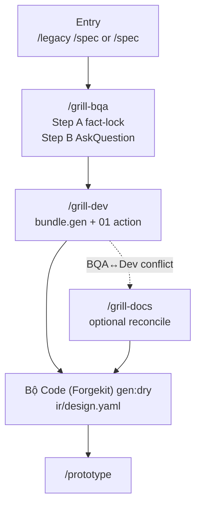

# Grill — Spec Validation + Decision Resolution

> Một diagram · [Toolchain index](..)

Treo câu hỏi: **không** `openQuestions` trên YAML. AskQuestion → ghi field, hoặc `qa/open/QA-<bundle.id>-NNNN.yaml` rồi `/qa-resolve`.

## Load policy

| Phase | Load | Không load |
|-------|------|------------|
| `/grill-bqa` | Toàn bộ `ir/design.yaml` (layout/copy) + `ir/spec.yaml` prose | Sửa `ir/*` tay; invent field |
| `/grill-dev` | `ir/design.yaml` + sibling `api/<seq>/01` | `bundle.spec.api`; `ir/spec.yaml` làm codegen input |
| `/grill-docs` | Bundle + ir reconcile | Archaeology lại |

## grillStatus

| Field | Set bởi |
|-------|---------|
| `bqaFacts` / `bqaOpen` | `/grill-bqa` |
| `dev` | `/grill-dev` khi `codegen.profile` + entity/module + 01 `action` đủ (split **fail** nếu `done` thiếu) |

Extract: skills `grill-bqa`, `grill-dev`, `grill-docs`, `qa-resolve`.

## Liên kết

| Doc | Nội dung |
|-----|----------|
| [TECH-DEBT-FLOW](../2-lifecycle/quality-maintenance.md) | `#tech-debt:QA-…` khớp file `qa/open` |
| [UPDATE-SPEC-FLOW](../2-lifecycle/quality-maintenance.md) | `/update-spec` delta FE |
| [DESIGN-PHASE-DIAGRAM](../2-lifecycle/overview.md) | Cycle đến `/prototype` |
