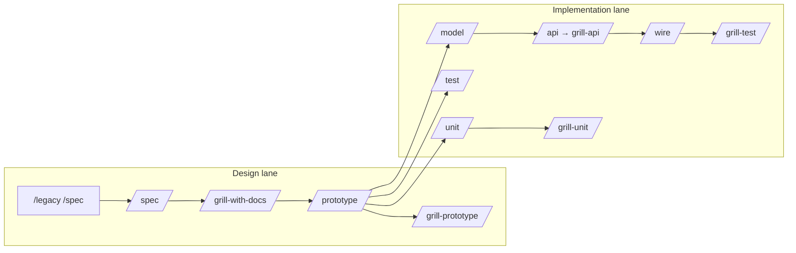

# Prompt Templates — Team AI Flow

> Copy/paste vào Cursor Agent. Thay placeholder `{...}`. Chi tiết command: [Toolchain index](..) · Skills: `.cursor/skills/`

**Quy tắc:** một session = một command · chat mới khi đổi phase · cập nhật `.harness/progress.md` trước khi đóng session.

---

## Sơ đồ lane



**Placeholder thường dùng**

| Placeholder | Ví dụ |
|-------------|-------|
| `{surface}` | `admin-web` |
| `{module}` | `CMP-01-auth` |
| `{slug}` | `login`, `hotel-list` |
| `{id}` | `W-AD-AUTH-001`, `API-AD-AUTH-001` |
| Spec path | `product/surfaces/<surface>/CMP-*/<NN…>/` |
| Common ID | `product/surfaces/common/code/{UI-CMN-*\|API-CMN-*}/` |

---

## Block chung (dán đầu mọi prompt — tùy chọn)

```text
Một session = một command. Chỉ làm đúng scope command này.

Surface: {admin-web} · Module: {CMP-…} · Function slug: {hotel-list}
Spec: prefer `--id` → `product/surfaces/.../CMP-*/<NN…>/ir/design.yaml`
Common UI: --id {UI-CMN-*} → product/surfaces/common/code/UI-CMN-*/

Ràng buộc:
- Tuân agent-discipline: sửa tối thiểu, không refactor ngoài scope
- Contract naming: giữ nguyên key API/model, không đổi tên tiện FE
- Docs/handoff tiếng Việt; key kỹ thuật giữ English
- Không đọc cả repo — chỉ file liên quan ID/slug trên
- Xong: cập nhật .harness/progress.md (nếu có)
```

---

## Design lane

### `/legacy /spec` — Code → spec (brownfield; không còn `/legacy-spec`)

**Khi nào:** Nguồn sự thật là code/docs legacy, chưa có spec.

**Cách gọi:** modifier **`/legacy`** + skill Bộ Docs (Forgekit) **`/spec`** (hoặc skill khác: `/module`, `/business-process-trace`, …).  
**Prerequisite:** source path do user cung cấp hoặc cấu hình repo đích.

```text
/legacy /spec

Owner surface: {admin-web}
Module: {CMP-…}
Function slug: {hotel-list}
Nguồn legacy: resolve từ platform-repos / legacy-repos — không đoán path ([PROJECT-MAPS](./repo-split-map.md)).

Scope:
- Chỉ đọc/phân tích code; KHÔNG sửa production code
- Inventory compact trước; không đọc cả repo
- 1 màn = 1 leaf `CMP-*/<NN…>/` (bundle + ir/ + api/seq)

Output:
- product/surfaces/<surface>/CMP-*/<NN…>/
- product/legacy-dynamics/…/_legacy.dynamics.yaml khi cần archaeology
- pnpm forge:render && pnpm forge:publish
- Evidence: inferredFromCode | qa/open — không bịa business intent

Handoff: gap lớn → /grill-with-docs · refine → /spec · UI → /prototype
```

---

### `/spec` — Spec mới / bổ sung từ requirement

**Khi nào:** Có requirement mới, hoặc refine spec đã có.

```text
/spec

Surface: {admin-web}
Module: {CMP-…}
Function slug: {hotel-list}
Requirement: {mô tả ngắn: list + search + pagination + row actions}

Tham chiếu:
- Common UI: --id {UI-CMN-*} (product/surfaces/common/code/…)
- 1 slug = 1 function; không gộp create/update vào cùng folder

Scope IN: `base-docs` + `base-tests`, harness notes
Scope OUT: pages/, components/, mocks/, E2E, unit

Làm:
1. Nếu ir/design.yaml đã có → verify gap (layout, actions, validation)
2. Nếu mới → draft bundle dưới …/CMP-*/<NN…>/
3. Testcase round 1 khớp acceptance
4. pnpm forge:render && pnpm forge:publish
5. Câu treo → qa/open/QA-… (không openQuestions trên YAML)

Handoff: gap chưa rõ → /grill-with-docs · UI → /prototype
```

**Variant — tách function slug:**

```text
/spec

Tách slug mới: {hotel-create} từ {hotel-list} trong cùng CMP-*.
Chỉ scope create form + validation + API POST. Link dependency trong notes của list.
```

---

### `/grill-with-docs` — Phỏng vấn spec trước prototype

**Khi nào:** Sau `/spec` hoặc `/legacy /spec`, **trước** `/prototype`.

```text
/grill-docs

Target: --id {W-*}
Path: product/surfaces/<surface>/CMP-*/<NN…>/

Focus batch này (chọn 1–2 chủ đề, không hỏi lan):
- [ ] actors + permissions
- [ ] empty state + loading + error API
- [ ] pagination (page size, ≥2 page mock sau này)
- [ ] row actions + confirm dialog destructive
- [ ] API contract shape

Style:
- Hỏi theo batch 3–5 câu cụ thể, có ví dụ
- User trả lời → cập nhật YAML ngay + pnpm forge:render
- Sau interview: **codegen readiness**; gate `pnpm portal:gen:dry --id <W-*>`
- Dừng khi dry-run pass; không implement UI

Handoff: /prototype khi dry-run pass
```

**Variant — ghi ADR:**

```text
/grill-with-docs

Target: --id {W-*}
Sau khi chốt: ghi ADR architecture/09-decisions/ADR-… cho quyết định RBAC.
```

---

### `/prototype` — UI thật, mock chỉ API boundary

**Khi nào:** Spec đã approve (qua grill nếu phức tạp).

```text
/prototype

Function slug: {hotel-list}
Spec: prefer `--id {W-*}`

Order:
1. Read spec tags — `#needs-component` inventory (Mo* names from grill)
2. Implement missing Mo* molecules in /prototype (gen does not emit stubs)
3. Registry promote if common — DESIGN-REGISTRY-PROMOTION.md · UI-CMN-* under product/surfaces/common/code/
4. pnpm portal:gen --id {W-*} --force
5. HANDOFF *Prototype next* = remaining slots only; wire-only / manual-composable

Scope IN: components (Mo* only if tagged), wire generated pages, mocks boundary, testId
Scope OUT: hand-write models/service/composable/page if gen already emitted them
```

**Variant — chỉ một màn:**

```text
/prototype

Function slug: {hotel-create}
Chỉ form create + validation inline alert. Không làm list trong session này.
```

---

### `/grill-prototype` — Audit trước demo / handoff

**Khi nào:** Sau `/prototype`, trước demo team, `/test`, hoặc `/wire`.

```text
/grill-prototype

Function slug: {hotel-list}
Route prototype: {/admin/hotels}

Checklist (verify, sửa trong scope nếu rõ):
- [ ] Khớp spec: happy path, validation message, loading/empty/error
- [ ] Mock pagination ≥2 pages
- [ ] Không gọi backend thật; mock đúng boundary
- [ ] DataListPage / registry shell reuse; composable mock boundary
- [ ] testcase testIds.required ⊆ UI (E2E-TESTIDS)
- [ ] Auth bypass documented
- [ ] Layout: text/icon/vị trí theo common UI

Không chạy Playwright/Vitest.
Extracts: verify-gate, common-ui-spec, portal-test-readiness

Handoff (tiếng Việt): route, spec + testcase files, testIds ok/missing,
setup.session + mocks vs spec api, #wire-only list, open issues → /test
```

---

## Implementation lane — Models & Backend

### `/model` — Chỉ `models/`

```text
/model

Function slug: {hotel-list}
Spec: prefer `--id {W-*|API-*}`

Scope: CHỈ models/{entity}/
- Zod API contract + z.infer types
- Key khớp spec/API/BE; validation UI để validations/
- Không $apiFetch; không sửa service/composable/page/test

Done: schema compile, types export, không import ngược tầng trên

Handoff: /wire hoặc /unit (parser) sau khi có API thật
```

---

### `/api` — Router backend (từ Portal workspace)

```text
/api

Function slug: {hotel-list}
Portal spec: prefer `--id {API-*}`
Path: product/surfaces/<surface>/CMP-*/<NN…>/api/<seq>/

Resolve backend từ platform-repos — stop nếu thiếu config.
Đọc ir/spec + testcase; align key với Portal models/.

KHÔNG implement BE trong portal workspace.
Báo rõ repo/path đã đọc.

Pipeline BE (Bộ Code (Forgekit) trên repo api/): /api → /grill-api

Handoff Portal: /grill-api → /wire
```

---

### `/grill-api` — Kiểm tra BE xong, trước `/wire` (Portal)

```text
/grill-api

Function slug: {hotel-list}
Backend: đã /api xong (ghi path evidence)

Checklist:
- [ ] Endpoints cover spec actions
- [ ] Request/response/pagination khớp FE models/
- [ ] Validation, permission, error shapes documented cho /wire
- [ ] Backend test status

KHÔNG sửa Portal UI. KHÔNG rename contract.
Extract: legacy-blade-to-api

Handoff: /wire khi checklist pass hoặc open issues rõ
```

---

### `/wire` — Thay mock bằng API thật

```text
/wire

Function slug: {hotel-list}

Inputs:
- ir/spec.yaml + testcase YAML (resolve bằng --id)
- BE contract / staging response
- Prototype hiện tại + danh sách route auth bypass cần restore

Order:
1. Align models/ với API thật
2. services/* + $apiFetch + parseApiData
3. composables gọi service
4. validations nếu 422 cần map
5. pages/components bind composable
6. Gỡ mock production
7. Restore auth/guest/rbac middleware (từ grill-prototype handoff)
8. Chạy scoped E2E liên quan

Rules: 4 tầng Portal; không rename field; mock chỉ test/fallback explicit

Verify: lint/typecheck + scoped E2E — báo exit code (verify-gate)

Handoff: /grill-test nếu E2E đã có; gap test → /test
```

---

## Testing lane

### `/test` — Playwright E2E

```text
/test

Function slug: {hotel-list}
Scenario focus: {hotel-list-empty} (1 testcase YAML / session)

Inputs (only — không đoán path):
- --id → …/CMP-*/NN…/ir/design.yaml (FE) · …/api/<seq>/01-backend-spec.yaml (BE)
- testcase YAML (E2E only; không map unit)
- Prototype UI + composables

Readiness: .cursor/extracts/test/readiness.md

Rules:
- Testcase YAML = E2E source of truth (1 file ≈ 1 tests/e2e/{module}/{function}.spec.ts)
- Page Object: tests/e2e/pages/{module}/*Page.ts — getByTestId only
- helpers/session.ts cho setup.session; fixtures/ cho mocks
- Vertical slice: 1 testcase → PO + spec → pnpm test:e2e scoped → scenario tiếp
- Pre-/wire: mock theo testcase.setup.mocks; post-/wire: API thật; #wire-only mock/skip

Sau goto: assertLayoutIntegrity khi smoke / semantic assertions

Verify: pnpm test:e2e {path-to-spec} — báo exit code (verify-gate)

Done: /grill-test → pnpm portal:lifecycle set {route} test
```

**Variant — testcase YAML slice:**

```text
/test

Implement Playwright từ testcase {hotel-list-empty}
Spec: prefer `--id {W-*}`
Rules: getByTestId only, Page Object, storageState, Faker khi data.dynamic
```

---

### `/grill-test` — Audit E2E coverage

```text
/grill-test

Function slug: {hotel-list}

Matrix: requirementIds ↔ testcase ↔ spec file ↔ tests/e2e/*.spec.ts

Cross-check spec + testcase YAML vs tests/e2e/:
- [ ] Mỗi function split có testcase + Playwright spec + PO
- [ ] testIds.required trên UI và trong PO
- [ ] List: happy path; pagination ≥2 pages khi mock có
- [ ] Create/edit/detail/row actions theo spec split
- [ ] #wire-only: mock hoặc skip pre-wire
- [ ] PO only — không getByTestId/css/xpath trực tiếp trong spec
- [ ] Scoped pnpm test:e2e pass hoặc root cause rõ (verify-gate)

Extracts: portal-test-readiness, verify-gate
Pass → pnpm portal:lifecycle set {route} test
Không thay /test; không backend; không Vitest
```

---

### `/unit` — Vitest

```text
/unit

Function slug: {hotel-list}
Focus: {list composable load + empty state} (1 behavior / session)

Scope: tests/unit/ — logic only, không browser
Good targets: validations/, service parser, composable state, store actions, pure helpers

Rules:
- Test public interface; mock $apiFetch tại service boundary
- Vertical slice: 1 behavior → 1 test → green → tiếp
- Không mock call-count nội bộ

Verify: pnpm test:unit {scoped-path} — báo exit code

Handoff: /grill-unit
```

---

### `/grill-unit` — Audit unit coverage

```text
/grill-unit

Function slug: {hotel-list}

Sau /unit, kiểm tra:
- [ ] Behaviors quan trọng qua public interface
- [ ] Boundary mock đúng; không skip/ignore giả
- [ ] Gap đặt tên file/branch nếu team target 100%
- [ ] Không Playwright ở đây

Không thay /unit
```

---

## Utility

### `platform-base` — Convention chung (tránh lạm dụng)

Chỉ khi **không** fit command cụ thể (shared component, review architecture).

```text
@platform-base skill

Task: {thêm testId cho FormField suffix pattern mới}
Scope: components/molecules/MoFormField.vue only
Không đọc reference.md trừ khi cần template code đầy đủ
```

---

## Lộ trình session gợi ý (feature mới)

| # | Command | Ghi chú |
|---|---------|---------|
| 1 | `/legacy /spec` hoặc `/spec` | Brownfield = modifier `/legacy` + Bộ Docs (Forgekit) `/spec` |
| 2 | `/grill-with-docs` | Permission + empty + API contract |
| 3 | `/prototype` | List page mock 2 pages |
| 4 | `/grill-prototype` | Audit trước demo |
| 5 | `/model` | Zod list response |
| 6 | `/api` → `/grill-api` | Bộ Code (Forgekit) trên repo `api/` |
| 7 | `/test` | 1 scenario / session |
| 8 | `/wire` | Thay mock, restore auth |
| 9 | `/unit` | Validation + service parser |
| 10 | `/grill-test` + `/grill-unit` | Audit trước release |

Mỗi ô = **chat mới** + block chung + template command.

---

## `.harness/progress.md` — snippet cuối session

```markdown
## {hotel-list} · W-… · CMP-…

| Phase | Status | Notes |
|-------|--------|-------|
| spec | done | openQuestions: pagination default 20 |
| grill-with-docs | done | ADR permission |
| prototype | done | auth bypass: /admin/hotels |
| grill-prototype | done | 2 issues → fixed |
| model | done | models/… |
| api | done | api repo PR #123 |
| wire | in_progress | list wired, create pending |
| test | pending | empty + create |
```

Session mới: *"Đọc .harness/progress.md, tiếp tục /wire cho slug hotel-create"*.

---

## Token tips (tóm tắt)

| Việc | Gợi ý |
|------|--------|
| Scope | Một command, một slug, một scenario |
| Context | Trỏ path spec — không paste cả YAML vào chat |
| Skill | Không @ `platform-base/reference.md` trừ khi cần template |
| Model Cursor | Auto cho `/model`, `/wire`, `/prototype`; Premium cho grill/debug |
| Session | Chat mới khi đổi phase; harness thay vì kể lại chat cũ |
| Scaffold | `pnpm portal:gen --spec ...` trước `/prototype`; agent chỉ HANDOFF + diff |
| Registry | Sau prototype: promote reusable UI → `registries/design.registry.json` — [DESIGN-REGISTRY-PROMOTION.md](../3-artifacts/design-registry-promotion.md) |

Chi tiết codegen: [Portal reference](https://github.com/raintr91/nuxt_4/blob/nuxt_v_3/docs/operational/PORTAL-CODEGEN.md) · `.cursor/extracts/codegen/tags.md` · token budget: `.cursor/extracts/artifact-graph.md`.
